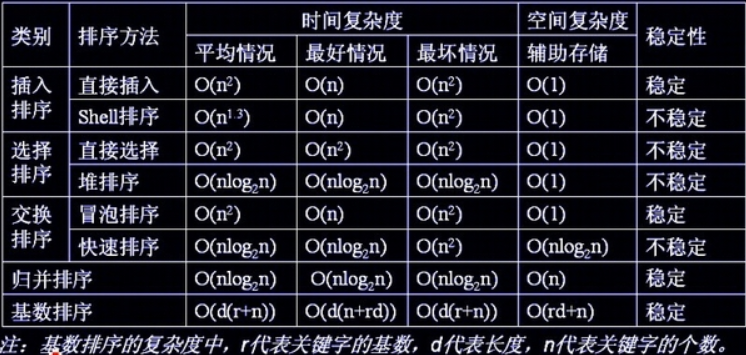

# Coding-Interviews/剑指offer

#### 排序算法

[插入排序](./src/main/java/排序算法/插入排序/Solution.java)

[选择排序](./src/main/java/排序算法/选择排序/Solution.java)

[冒泡排序](./src/main/java/排序算法/冒泡排序/Solution.java)

[快速排序](./src/main/java/排序算法/快速排序/Solution.java)

[归并排序](./src/main/java/排序算法/归并排序/Solution.java)

[希尔排序](./src/main/java/排序算法/希尔排序/Solution.java)

[堆排序](./src/main/java/排序算法/堆排序/Solution.java)

[基数排序](./src/main/java/排序算法/基数排序/Solution.java)

### 稳定性：

**理解：** 排序前2个相等的数其在序列的前后位置顺序和排序后它们两个的前后位置顺序相同。 

**用处：** 只有当在“二次”排序时不想破坏原先次序，稳定性才有意义 。

>  如果我们只对一串数字排序，那么稳定与否确实不重要，因为一串数字的属性是单一的，
就是数字值的大小。但是排序的元素往往不只有一个属性，例如我们对一群人按年龄排序，
但是人除了年龄属性还有身高体重属性，在年龄相同时如果不想破坏原先身高体重的次序，
就必须用稳定排序算法. 

#### 面试题

[面试题3_数组中重复的数字](./src/main/java/面试题3_数组中重复的数字/Solution.java)

[面试题4_二维数组中的查找](./src/main/java/面试题4_二维数组中的查找/Solution.java)

[面试题5_替换空格](./src/main/java/面试题5_替换空格/Solution.java)

[面试题6_从尾到头打印链表](./src/main/java/面试题6_从尾到头打印链表/Solution.java)

[面试题7_重建二叉树](./src/main/java/面试题7_重建二叉树/Solution.java)

[面试题8_二叉树的下一个节点](./src/main/java/面试题8_二叉树的下一个节点/Solution.java)

[面试题9_用两个栈实现队列](./src/main/java/面试题9_用两个栈实现队列/Solution.java)

[面试题10_斐波那契数列](./src/main/java/面试题10_斐波那契数列/Solution.java)

[面试题11_旋转数组的最小数字](./src/main/java/面试题11_旋转数组的最小数字/Solution.java)

[面试题12_矩阵中的路径](./src/main/java/面试题12_矩阵中的路径/Solution.java)

[面试题13_机器人的运动范围](./src/main/java/面试题13_机器人的运动范围/Solution.java)

[面试题14_剪绳子](./src/main/java/面试题14_剪绳子/Solution.java)

[面试题15_二进制中1的个数](./src/main/java/面试题15_二进制中1的个数/Solution.java)

[面试题16_数值的整数次方](./src/main/java/面试题16_数值的整数次方/Solution.java)

[面试题17_打印1到最大的n位数](./src/main/java/面试题17_打印1到最大的n位数/Solution.java)

[面试题18_删除链表的结点](./src/main/java/面试题18_删除链表的结点/Solution.java)

[面试题19_正则表达式匹配](./src/main/java/面试题19_正则表达式匹配/Solution.java)